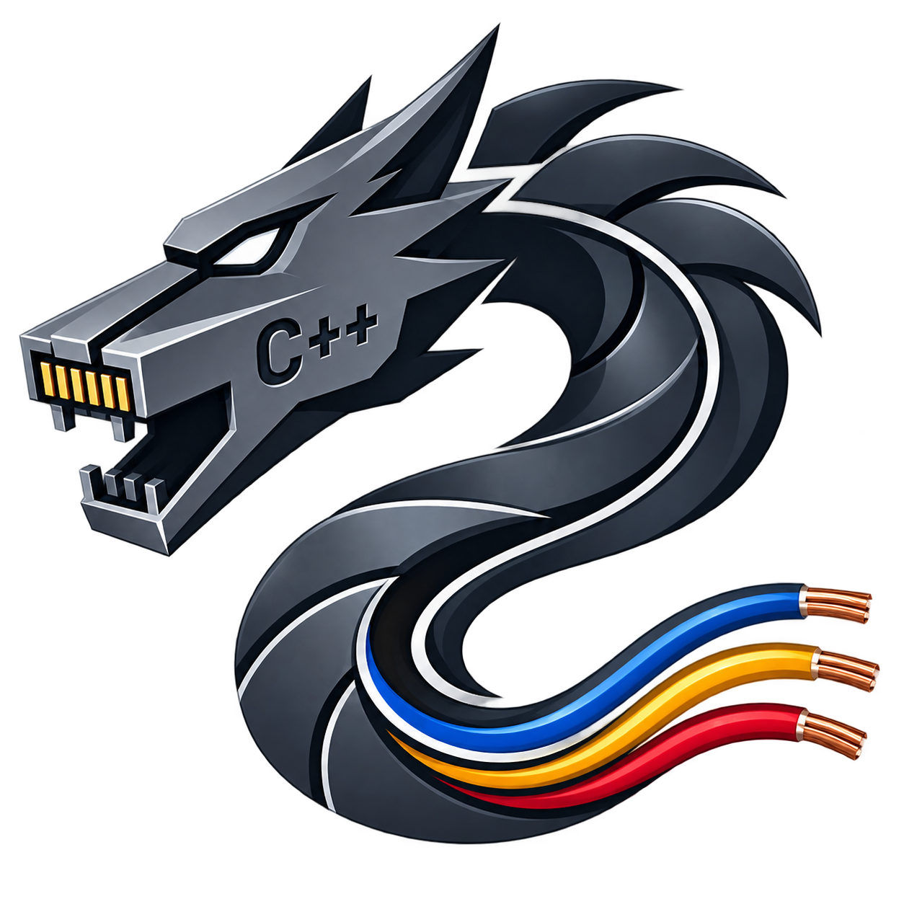

# Dracon



Dracon is a small, fast HTTP/HTTPS server for Linux, written from scratch in C++23 on
top of `epoll` and Boost.Coroutine2, with no Boost.Asio and no framework. The server
itself only speaks HTTP: every request is answered by a **plugin**, a shared library
it loads at start up.

Each connection runs inside its own coroutine, so a handler is written as plain
sequential code while every read and write that would block yields back to the event
loop. One event loop per hardware thread, and the connections are spread over them,
which is what lets a handful of threads carry a very large number of concurrent
connections.

Dracon is in beta: it has no stable API/ABI yet.

## Build

Needs CMake ≥ 3.28, Ninja, a C++23 compiler (GCC ≥ 13 or Clang ≥ 17), Boost ≥ 1.70
(coroutine, log, log_setup, program_options, iostreams) and OpenSSL ≥ 3.0. The tests
additionally need Boost.test and libcurl, and are configured when both are found.

```sh
cmake -G Ninja -B build -DCMAKE_BUILD_TYPE=Release
cmake --build build
ctest --test-dir build --output-on-failure
```

The build tree mirrors an install prefix and the server resolves its paths relative to
its own binary, so it runs straight from there with no arguments:

```
build/bin/dracon                    the server
build/lib/dracon/plugins/           plugins it loads at start up
build/etc/dracon/                   server.conf and friends
```

```sh
build/bin/dracon                    # http://localhost:8080, https://localhost:8443
build/bin/dracon --help
```

## Writing a plugin

A plugin is a shared library which exports a couple of C functions. `create_session()`
is asked, once per request, whether it wants to handle it; if it does, it returns the
callable which will:

```cpp
#include <dracon/http.h>
#include <dracon/plugin.h>

PLUGIN_EXPORT uint32_t plugin_order() { return 0; }

PLUGIN_EXPORT dracon::http_session create_session(const dracon::request &req)
{
    if (req.url() != "/hello")
        return {}; // not ours, the server asks the next plugin

    return [](dracon::abstract_stream &stream, dracon::request &req) {
        stream >> req; // read the rest of the request
        stream << dracon::response{200, "hello\n"};
    };
}
```

Drop the resulting `.so` into the plugins directory and it is live on the next start.
The whole plugin API is the header-only `include/dracon/`: requests and responses
(`http.h`), streams and chunked output (`stream.h`), RESTful routing (`restful.h`),
worker threads for slow work (`thread_worker.h`), and the contract itself, including
how errors are reported, in `plugin.h`.

### Routing a REST API

For an API, `restful.h` does the URL matching instead. The handler *is* the session,
and the resources a route captures arrive as ordinary arguments in the order it
declares them, so one function can serve a whole family of routes and the shorter
ones hand over empty strings:

```cpp
#include <dracon/plugin.h>
#include <dracon/restful.h>

dracon::restful_router router{"/api/v1/"};

static void customers(dracon::abstract_stream &stream, dracon::request &req,
                      const std::string &customer_id = {},
                      const std::string &license_id = {})
{
    stream >> req;
    stream << dracon::response{200, "customer " + customer_id +
                                    ", license " + license_id + "\n"};
}

PLUGIN_EXPORT bool init_plugin(const std::string &/*conf_dir*/)
{
    for (const auto route : {"customers",
                             "customers/{customer_id}",
                             "customers/{customer_id}/licenses/{license_id}"})
        router.create_route(route)->add_method_handler("GET", customers);
    return true;
}

PLUGIN_EXPORT uint32_t plugin_order() { return 0; }

PLUGIN_EXPORT dracon::http_session create_session(const dracon::request &req)
{
    return router.create_handler(req.url(), req.method());
}
```

Which answers all three, filling in whatever each one captured:

```
GET /api/v1/customers                 -> customer , license
GET /api/v1/customers/42              -> customer 42, license
GET /api/v1/customers/42/licenses/7   -> customer 42, license 7
```

Ask for `const std::optional<std::string> &` captures instead and a route which does
not have one hands over `nullopt`, which is worth the change when "this route has no
such resource" and "the resource is empty" have to read differently:

```cpp
static void orders(dracon::abstract_stream &stream, dracon::request &req,
                   const std::optional<std::string> &order_id = {})
{
    stream >> req;
    stream << dracon::response{200, order_id ? "order " + *order_id + "\n"
                                            : "all orders\n"};
}
```

An unknown method on a known route is answered with a 405 and the right `Allow`
header, without the handler being involved. Take a `dracon::parsed_route` as the last
argument instead of the captures when the query strings or the allowed methods are
wanted too; `add_method_handler` works out which shape a handler has.

`template/` is a ready to copy project: a REST plugin with its own config file and
tests. Point it at an installed Dracon, or let it fetch one.

## Configuration

Everything lives in `etc/dracon/`, in Boost property_tree INFO syntax:
`server.conf` (ports, timeouts, workers, privilege dropping) which includes
`server_logging.conf` (Boost.Log sinks) and `server_ssl_ctx.conf` (raw OpenSSL
`SSL_CONF_cmd` settings, so the TLS configuration is entirely yours). Each plugin
reads its own `<name>.conf` from the same directory.

The bundled `static_content` plugin serves files from the paths listed in
`static_files.conf`, and `server_status true` enables a small `/server_status` counter
page.

## Documentation

[`docs/`](docs) has the long version:

* [Building and running](docs/building.md)
* [Writing a plugin](docs/writing-a-plugin.md)
* [Requests and responses](docs/requests-and-responses.md)
* [Streams](docs/streams.md)
* [Routing a REST API](docs/routing.md)
* [Reporting errors](docs/errors.md)
* [Threads and slow work](docs/concurrency.md)
* [Logging](docs/logging.md)
* [Configuration](docs/configuration.md)
* [API reference](docs/api-reference.md)

## License

The server (`src/`) is AGPL v3. The public plugin API under `include/dracon/` carries
an AGPL exception (see `EXCEPTION.AGPL`), so plugins may be released under any license
you like.
